# AirSpeak

**AirSpeak** - стыковка проектов AirMQ и ThingSpeak.
Этот репозиторий содержит скрипты публичного канала данных [Погода в Лиде - датчики, сравнение и аналитика](https://thingspeak.mathworks.com/channels/1306405).
Автор этого репозитория не является сотрудником или разработчиком AirMQ, а только рядовым участником проекта.

# AirMQ

Проект мониторинга качества воздуха **AirMQ.by** предоставляет датчики, снабжённые сенсорами:
1. Температура
2. Влажность
3. Давление
4. Твёрдые частицы (1; 2,5 и 10 микрон)

Ссылки проекта
 - Сайт проекта [AirMQ.by](https://airmq.by/) или [AirMQ.cc](https://airmq.cc/) 
 - [Оборудование](https://airmq.by/device/)
 - [Репозиторий GitHub](https://github.com/AirMQ)

## Публикация данных

Из коробки [прошивка устройства](https://github.com/AirMQ/AirMQ-sensor/tree/master/Firmware) позволяет публиковать данные на трёх ресурсах:
- [AirMQ.by](https://airmq.by/)
- [Sensor.community](https://sensor.community)
- [narodmon.ru](https://narodmon.ru/)

Подключение устройства к этим сервисам описано на сайте проекта в разделе [FAQ](https://airmq.by/faq/). 

Более ранняя инструкция кроме упомянутых сервисов содержит методику подключения к [ThingSpeak.com](https://thingspeak.mathworks.com/) - [Публикация данных AirMQ в другие сервисы](https://telegra.ph/airmqby---narodmonru--sensorcommunity-02-15). Эта инструкция не является официальным документом проекта и может содержать неактуальную информацию.

# ThingSpeak.com
Интерес представляет публикация данных на ресурсе [ThingSpeak.com](https://thingspeak.com) 
так как позволяет собирать данные и упрощать анализ посредством визуализации. 

**ThingSpeak** - это облачная платформа с открытым исходным кодом интернета вещей (IoT), которая позволяет собирать, отображать и анализировать потоковые данные. Вы можете отправлять данные в ThingSpeak с различных устройств, настраивать их отображение в реальном времени и отправлять уведомления через Twitter и Twilio.

Аналитика **MATLAB** внутри ThingSpeak позволяет писать и запускать MATLAB-код для выполнения предобработки, визуализации и анализа данных. ThingSpeak позволяет инженерам и ученым прототипировать и строить IoT-системы без настройки серверов и разработки веб-приложений.

## Публикация данных AirMQ в ThingSpeak
Упомянутая выше [инструкция](https://telegra.ph/airmqby---narodmonru--sensorcommunity-02-15) гласит...

Для начала работы с сервисом необходимо пройти регистрацию, создать канал и заполнить поля в нём. 


Для отправки данных на сервис используется API-интерфейс. GET-запрос содержит API-Key и данные. Ключи для записи и чтения различные, их можно найти в настройках канала. 


Формат GET-запроса выглядит следующим образом: 

`https://api.thingspeak.com/update.json?api_key=XXX&fieldl=111&field2=222&field3=333&field4=444&field5=555&field6=666&field7=777&field8=888`

На каждый запрос сервер даст развёрнутый (JSON) ответ, где будут указаны Channel ID, значения всех полей, дата и время. Если ".json" в запросе отсутствует, то ответ будет лаконичным - только число записанных значений.

Ориентировочные строки кода для Rules

```
timerset,5,%v5%         // Запуск таймера. %v5% = 300 (каждые 5 минут)
```

```
on rules#timer=5 do     // Номер таймера
    asyncevent,sendTS   // Процедура, запускаемая при срабатывании таймера
    timerset,5,%v5%     // Запустить таймер снова
endon
```

```
on sendTS do            // Имя обработчика
                        // Выполняемая команда - отправить по протоколу HTTP
                        // Реальные данные подставляются вместо переменных
    SendToHTTP api.thingspeak.com,80,/update?api_key=XXX&field1=[BME#Temp]&field2=[BME#Hum]&field3=[BME#Press]&field4=[PMS#PMS1]&field5=[PMS#PMS25]&field6=[PMS#PMS10]
endon
```

## Анализ и визуализация ThingSpeak
В проекте ThingSpeak можно оперировать 4-мя сущностями:
1. Channel - данные
2. TimeControl - таймер
3. MATLAB Analysis - код аналитики
4. MATLAB Visualizations - визуализация

Названия реализациям сущностей можно давать произвольные. Так названия таймеров в этом проекте получились на разных языках.
Рассмотрим сущности подробней.

### Channels - Каналы данных
Проект содержит три канала данных:
 - lida_weather_log_1min
 - lida_weather_log_compare_10min
 - lida_weather_log_amp_1day

Данные от сенсора поступают в публичный канал и накапливаются в нём.
Так как размер канала конечен и в бесплатном аккаунте ThingSpeak это можно заметить, 
то созданы ещё каналы для хранения данных во временных срезах более длительного промежутка времени - для хранения данных сравнения и амплитудных значений.

#### lida_weather_log_1min
Канал данных, поступающих от сенсора.

Channel ID: `1306405`\
Access: `Public`\
Fields:
```
 1. Temperature
 2. Humidity
 3. Pressure
 4. PM1
 5. PM2.5
 6. PM10
```

#### lida_weather_log_compare_10min
Канал данных для сравнения и аналитики. Данные записываются по таймеру в 10 минут.

Channel ID: `1312197`\
Access: `Private`\
Fields:
```
 1. Temperature_Inet
 2. Humidity_Inet
 3. Temperature_sensor
 4. Humidity_sensor
 5. Dew_point_Inet
 6. Dew_point_sensor
 7. Dust_average_summ
```

#### lida_weather_log_amp_1day
Канал амплитудных и средних значений температуры от сенсора. Данные записываются по таймеру ежесуточно.

Channel ID: `1312844`\
Access: `Private`\
Fields:
```
 1. TemperatureMax
 2. TemperatureMin
 3. TemperatureAvg 
```

### TimeControl - таймеры
Таймер по расписанию запускает код аналитики.

| TimeControl | Recurrence | MATLAB Analysis |
|---|---|---|
| Grab from WTTR.IN every 10 minutes | Every 10 minutes | Temp+Hum+Dew+Dust - From WTTR.IN and SENSOR (10 minutes) |
| Суточный срез амплитудных значений | Daily | Calculate high and low 24h temperatures and write to channel "1day" |

### MATLAB Analysis - аналитика 
Коды аналитики собраны в файлах, котрые можно найти по этому пути - [https://github.com/Avrikan/AirSpeak/tree/main/ThingSpeak/Apps/MATLAB Analysis](https://github.com/Avrikan/AirSpeak/tree/main/ThingSpeak/Apps/MATLAB%20Analysis)

В рамках этого проекта аналитика содержит всего два кода:

#### 1. Temp+Hum+Dew+Dust - From WTTR.IN and SENSOR (10 minutes)
Запускается по таймеру в 10 минут.\
Читает данные из ежеминутного канала сенсора `lida_weather_log_1min` за последние 10 минут. Усредняет значения.\
Читает данные из ресурса `wttr.in` (подробнее в артикуле WTTR.IN).\
Подсчитывает для обоих вариантов точку росы по формуле:
```
    b = 17.62;
    c = 243.5;
    gamma = log(humidity/100) + b*temp./(c+temp);
    dewPoint = c*gamma./(b-gamma);
```
Записывает данные в канал `lida_weather_log_compare_10min`

#### 2. Calculate high and low 24h temperatures
Запускается по таймеру ежесуточно.\
Читает данные из ежеминутного канала сенсора `lida_weather_log_1min` за последние сутки.\
Находит максимум, минимум и среднее значение за сутки. Записывает их в канал `lida_weather_log_amp_1day`.

### Диаграмма
Движение данных показано в этой диаграмме.

```mermaid
flowchart TD
    A([<b>SENSOR</b>]) ==> |SendToHTTP| 1min[(lida_weather_log_1min)]
    W([<b>WTTR.IN</b>]) ====> |Prometheus| FROM
    1min ====> |thingSpeakRead| FROM

    GRAB[/Grab from WTTR.IN every 10 minutes/]
    SREZ[/Суточный срез амплитудных значений/]
    
    GRAB --> |EXEC| FROM[Temp+Hum+Dew+Dust - From WTTR.IN and SENSOR]
    SREZ --> |EXEC| CALC[Calculate high and low 24h temperatures]
    
    FROM ==> |thingSpeakWrite| 10min[(lida_weather_log_compare_10min)] 
    CALC ==> |thingSpeakWrite| 1day[(lida_weather_log_amp_1day)]

    1min ====> |thingSpeakRead| CALC
    subgraph TimeControl
        GRAB
        SREZ
    end    
    subgraph 10 min
        FROM
        10min
    end    
    subgraph 1 day
        CALC
        1day
    end    
    style GRAB fill:#502050
    style SREZ fill:#502050
    style 1min fill:#205020
    style 10min fill:#205020
    style 1day fill:#205020
    style A fill:#053005
    style W fill:#053005
```


### MATLAB Visualizations - визуализация
Визуализация реализована в виде виджетов и графиков. Визуализация может быть приватной и публичной. Коды предоставлены в репозитории в соответствующих файлах по этому пути - [https://github.com/Avrikan/AirSpeak/tree/main/ThingSpeak/Apps/MATLAB Visualizations](https://github.com/Avrikan/AirSpeak/tree/main/ThingSpeak/Apps/MATLAB%20Visualizations)

Результаты можно посмотреть в моём публичном канале [lida_weather_log_1min](https://thingspeak.mathworks.com/channels/1306405) 


# Эталон
Конкретно мой сенсор в летние денёчки попадает сутра под солнышко и люто врёт по температуре в первой половине дня.
Но даже при идеальном расположении полезно сравнить свой сенсор с эталоном. Я свой экземпляр сравнил с подобной этой [Хабровской Термокосой](https://habr.com/ru/articles/242377/). 
И следующим этапом было сравнение с on-line сенсорами.  

## pogoda.by
Для сравнения показаний сенсора с эталоном изначально был выбран сайт `pogoda.by` но после рестайлинга этого сайта парсить данные стало неудобно. 
[Pogoda.by](https://pogoda.by/) предоставляет [RSS-данные](https://pogoda.by/services/rss), но в них внезапно нет влажности.
RSS-данные для Лиды выглядят так [https://pogoda.by/rss/weather?station=26832](https://pogoda.by/rss/weather?station=26832
) 
```
<?xml version="1.0"?>
<rss version="2.0">
  <channel>
    <title>POGODA.BY | Фактическая погода Лида, BY</title>
    <link>https://pogoda.by/rss/weather?station=26832</link>
    <description><![CDATA[ Белгидромет. Фактическая погода Лида, BY. ]]></description>
    <language>ru-ru</language>
    <item>
      <title>
    Лида - фактическая погода за  Wed Nov 27 2024 10:30:00 GMT+0000 (Coordinated Universal Time)
    </title>
      <link>https://pogoda.by/observation/meteo-observation/26832</link>
      <guid isPermaLink="false">173270340000026832</guid>
      <pubDate>Wed Nov 27 2024 10:30:00 GMT+0000 (Coordinated Universal Time)</pubDate>
      <description><![CDATA[Температура +5.4°C | Давление 1002.1 гПа | Ветер 3.5 м/с, Западный | Погода: Без особых явлений ]]></description>
    </item>
  </channel>
</rss>
```
## i.centr.by


Хорошую оперативность данных с точностью до сотых показывает ресурс [i.centr.by](https://i.centr.by/inforoads/ru/dises/current), но и его парсить оказалось проблематично.

## wttr.in


Таким образом в качестве эталона был выбран ресурс `wttr.in` удобство работы с которым очень радует.
У ресурса [wttr.in](https://wttr.in/) есть [репозиторий на GitHub](https://github.com/chubin/wttr.in).
Запрос на данные было решено выполнять в `Prometheus Metrics` следующим запросом:
[https://wttr.in/Lida+Belarus?format=p1](https://wttr.in/Lida+Belarus?format=p1)

